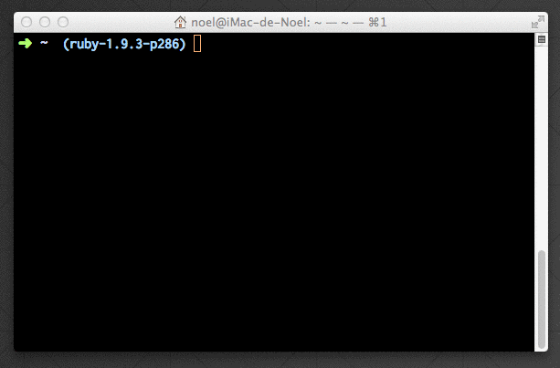

# Metallum

Search and print out lyrics from [metal-archives.com](https://www.metal-archives.com) using the command-line.



## Usage

```sh
python ~/<path-to-repo>/metallum.py <band_name> <song_title>
```

Additionally, you can create an alias on your `.zshrc` or `.bash_profile`:

```sh
alias met="python ~/<path-to-repo>/metallum.py"
```

So you can use it like:

```sh
met therion quetzalcoatl
```

### You don't have to type the whole thing

Sometimes song titles (or even band names) are too long to type or even to remember them.

Let‘s put as an example the song ***“In an Excruciating Way Infested with Vermin and Violated by Executioners Who Practise Incendiarism and Desanctifying the Pious”*** by ***“Wormphlegm”*** ... well, you can get the lyrics by just typing:

```sh
met wormphlegm infested
```

Or the song ***“The Dark Liege Of Chaos Is Unleashed At The Ensorcelled Shrine Of A’Zura Kai (The Splendour Of A Thousand Swords Gleaming Beneath The Blazon Of The Hyperborean Empire Part II)”*** by ***“Bal-Sagoth”***

```sh
met balsagoth chaos
```

## License
MIT © [Noel Delgado](http://pixelia.me/)
